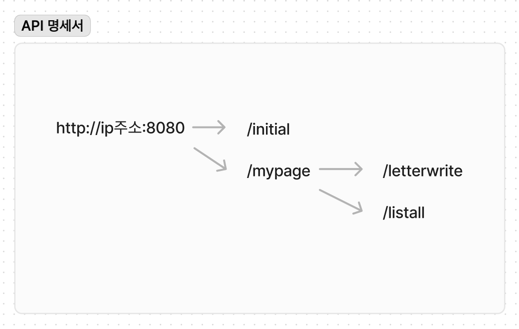

# 📖 Near and Dear

- Test ID : root
- Test PW : 1234

 

## 프로젝트 소개

- 나의 청춘이 우리 가족의 청춘이 될 수 있도록, 틈틈히 서로의 진심을 모아 전할 수 있도록 도와주는 서비스이다
- 부모님꼐 평소에 하지 못했던 말을 편지라는 매개를 통해 보내주는 서비스

 

## 1. 약식 백엔드 API 명세서

- 

## 2. 백엔드 역할 분담

### 🍊영기김

- **기능**
    - Letter, Question, QuestionAnswer, confing, usercontroller 개발.

 

### 👻준현쨩

- **기능**
    - User dto, entity, service 개발.

 

## 3. 개발 기간 및 작업 관리

### 개발 기간

- 아이디어 피칭 : 5/24 19:00 ~ 5/24 23:00
- 기능 구현 : 5/24 23:00 ~ 5/25 10:00

 

### 작업 관리

- GitHub Projects와 Issues를 사용하여 진행 상황을 공유했습니다.

 

## 4. 페이지별 기능

### [프로필 설정]
- 편지를 보낼 사람, 쓸 편지 개수, d-day 날짜, 수신자 이름, 수신자 주소, 수신자 전화번호를 입력받습니다.

 

### [마이페이지]
- 현재까지 쓴 편지를 불러옵니다.
- 현재까지 쓴 편지의 갯수를 상단에 전시합니다.
- 남은 D-date를 상단에 전시합니다.
- 지금까지 쓴 편지 중 가장 최근에 쓴 편지들을 전시합니다.

 

### [편지 작성 페이지].

- 사용자는 상단에 있는 두개의 랜덤 질문에 답하고 백에서는 그 데이터를 받습니다.
- 사용자는 하단에 있는 자율 답변 창에 편지를 쓰고 백에서는 그 데이터를 받습니다.
